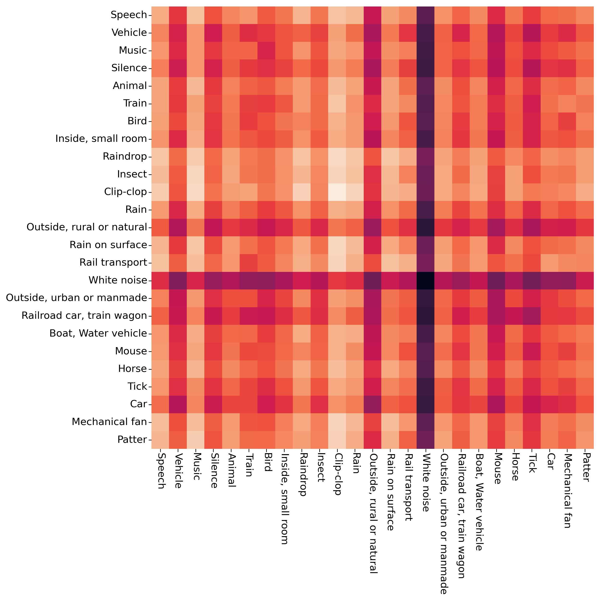

# ERGL

Arxiv file is available: https://arxiv.org/abs/2210.15366

The ERGL is uploading....

## Scene graphs consist of the top 25 events 
The top 25 events simply depend on the entire dataset and are not specifically selected for each single target scene. So for each scene graph, some events seem to be a little bit strange in the graph tree. At the semantic level, these 25 classes of events are slightly insufficient in describing 10 different classes of scenes. The top 25 events are automatically chosen by the classification model without involving artificial prior knowledge.

<h3 align="center"> 1. airport 

</h3>

  

<h3 align="center"> 2. bus 

</h3>

  

<h3 align="center"> 3. metro 

</h3>

 

<h3 align="center"> 4. metro station 

</h3>

  

<h3 align="center"> 5. park 

</h3>

  

<h3 align="center"> 6. public square 

</h3>

  

<h3 align="center"> 7. shopping mall 

</h3>

  

<h3 align="center"> 8. street pedestrian 

</h3>

  

<h3 align="center"> 9. street traffic 

</h3>

  

<h3 align="center"> 10. tram 

</h3>

  

## Averaged multi-dimensional edge values between nodes in samples of different acoustic scenes

<h3 align="center"> 1. airport 

</h3>

 

  

<h3 align="center"> 2. bus 

</h3>

 

  

<h3 align="center"> 3. metro 

</h3>

 

  

<h3 align="center"> 4. metro station 

</h3>

 

  

<h3 align="center"> 5. park 

</h3>

 

  

<h3 align="center"> 6. public square 

</h3>

 

  

<h3 align="center"> 7. shopping mall 

</h3>

 

  

<h3 align="center"> 8. street pedestrian 

</h3>

 

  

<h3 align="center"> 9. street traffic 

</h3>

 

  

<h3 align="center"> 10. tram 

</h3>

 

  

 
